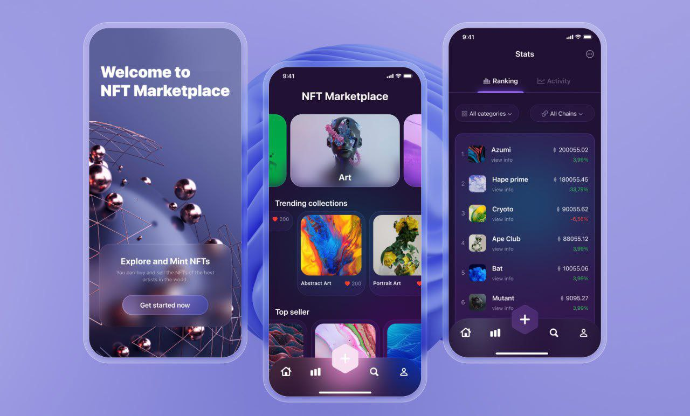

# Artora NFT Marketplace

Welcome to **Artora**, a modern NFT marketplace built with Flutter. Artora provides a seamless experience for exploring, buying, and selling NFTs, with a beautiful UI and robust features for collectors and creators alike.

---

## 🚀 Features

- **Home Page**: Discover trending NFTs, featured collections, and top sellers.
- **Stats & Rankings**: Explore marketplace statistics, rankings, and activity feeds.
- **Welcome Experience**: Engaging onboarding for new users.
- **Glassmorphism & Custom Widgets**: Modern UI components for a premium look.
- **Provider State Management**: Efficient and scalable state management.
- **Carousel Slider**: Interactive NFT and story carousels.
- **Google Fonts Integration**: Beautiful typography throughout the app.

---

## 📱 Screenshots



---

## 🛠️ Tech Stack

- **Flutter** (Dart 3.7+)
- **Provider** for state management
- **Google Fonts** for custom typography
- **Carousel Slider** for interactive UI
- **Custom Widgets** for glassmorphism and buttons

---

## 📂 Project Structure

```
lib/
  app.dart           # Main app entry point
  main.dart          # Flutter main function
  core/              # Theme & constants
  presentation/      # UI pages & widgets
  routes/            # App navigation
  shared/            # Services & shared widgets
assets/
  data/              # NFT & stats JSON
  icon/              # App icons
  image/             # App images
```

---

## ⚡ Getting Started

1. **Clone the repository**
	```powershell
	git clone https://github.com/ShervinKazemi/Artora.git
	cd Artora
	```
2. **Install dependencies**
	```powershell
	flutter pub get
	```
3. **Run the app**
	```powershell
	flutter run
	```

---

## 📄 Assets

- All images, icons, and data files are located in the `assets/` directory and referenced in `pubspec.yaml`.

---

> **Artora** – The future of NFT marketplaces, built for speed, beauty, and scalability.
